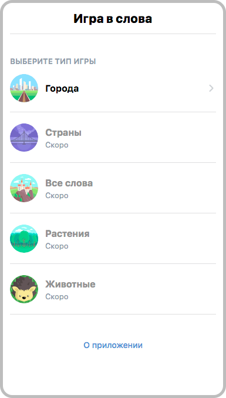

[](https://vk.com/services)

# Игра в слова (проект сделан в рамках хакатона)

Приложение позволяет играть в известную игру на базе VK Mini Apps. В игре можно будет выбирать различные наборы слов: города, страны, живонтные и др.

##### Скриншот главного экрана

 
# Возможности

- Играть в игру «Слова»
- Изучать новые факты о словах / городах и т.д.
- Получать подсказки в ходе игры
- Просматривать итоговый рейтинг

# TODO
- [x] Механика игры и выдача слов
- [x] Запросы на Википедию с краткими фактами о словах
- [x] Выдача подсказок
- [x] Валидация поля ввода слова
- [ ] Возможность игры с друзьями и другими пользователями
- [ ] Loading на время загрузки данных из базы
- [ ] Система вознаграждения в виде монет, за которые можно покупать подсказки
- [ ] Развёрнутая система рейтинга
- [ ] Улучшенный алгоритм выдачи слов
- [ ] Рефакторинг кода

# Демо/запуск проекта

Посмотреть можно по ссылке [https://prod-app7385543-42c75b46b07f.pages.vk-apps.com/index.html](https://prod-app7385543-42c75b46b07f.pages.vk-apps.com/index.html)

Чтобы запустить проект на своём компьютере — достаточно склонировать репозиторий и выполнить команды:
```
npm install
npm start
```
После введения команд готовый проект откроется в браузере автоматически.
